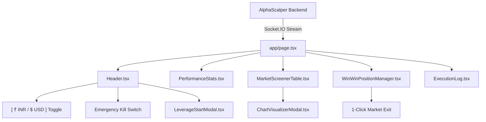

# 🖥️ AlphaScalper Frontend: Institutional AI Crypto Trading Terminal

> **Modern, ultra-responsive Cyberpunk / Dark-Themed High-Frequency Trading Terminal built with Next.js 14 App Router, TypeScript, Tailwind CSS, and Socket.IO. Features real-time multi-asset telemetry, dual-currency (₹ INR / $ USD) live switching, interactive TradingView charts, and one-click execution controls.**

---

## 📑 Table of Contents
- [Terminal Overview](#-terminal-overview)
- [Key Features](#-key-features)
  - [1. Real-Time Telemetry & WebSocket Engine](#1-real-time-telemetry--websocket-engine)
  - [2. Dual-Currency System (₹ INR / $ USD Toggle)](#2-dual-currency-system--inr---usd-toggle)
  - [3. 24-Hour Rolling Performance & Statistics Bar](#3-24-hour-rolling-performance--statistics-bar)
  - [4. AI Top-10 Ranked Target Screener](#4-ai-top-10-ranked-target-screener)
  - [5. Win-Win Position & Active Orders Manager](#5-win-win-position--active-orders-manager)
  - [6. Interactive TradingView Chart Visualizer](#6-interactive-tradingview-chart-visualizer)
  - [7. Autopilot Leverage Control & Safety Modals](#7-autopilot-leverage-control--safety-modals)
  - [8. Emergency Global Kill Switch](#8-emergency-global-kill-switch)
- [UI Architecture & Data Flow](#-ui-architecture--data-flow)
- [Project Directory Structure](#-project-directory-structure)
- [Prerequisites & Installation](#-prerequisites--installation)
- [Configuration (.env.local)](#-configuration-envlocal)
- [Development & Production Build](#-development--production-build)
- [License & Disclaimer](#-license--disclaimer)

---

## ⚡ Terminal Overview

AlphaScalper's frontend is designed for active algorithmic traders, institutional scalpers, and hedge funds who need split-second situational awareness:
- **Zero Refresh Required:** Powered by persistent Socket.IO WebSockets that stream telemetry every single second.
- **Dual-Currency Awareness:** View balances, margins, and PnL simultaneously in Indian Rupees (₹ INR) and US Dollars ($ USDT).
- **Sub-Second Execution:** Instant manual order triggers, position exits, and emergency cancellations.
- **Glassmorphic Cyberpunk Theme:** High-contrast, dark-mode optimized layout designed for 24/7 monitoring without eye fatigue.

---

## 🌟 Key Features

### 1. Real-Time Telemetry & WebSocket Engine
- Automatically connects to the FastAPI backend via persistent bi-directional **Socket.IO** (`ws://localhost:8000`).
- Receives unified `telemetry_update`, `positions_update`, `orders_update`, and `execution_event` broadcasts.
- Live connection health indicator displays latency and auto-reconnects with exponential backoff if disconnected.

### 2. Dual-Currency System (₹ INR / $ USD Toggle)
- Prominent header switch: `[ ₹ INR | $ USD ]`.
- Toggling immediately updates all dashboard metrics across the entire application:
  - Account Wallet Balance & Usable Margin
  - 24-Hour Earned Profit, Losses, and Net PnL
  - Live Active Positions (Unrealized PnL, Locked Margin, ROE %)
  - Top 10 Candidate Prices and Volumes
- Automatically detects CoinDCX's authentic settlement exchange rate (e.g. ₹89.50 / USDT) to guarantee penny-perfect accuracy.

### 3. 24-Hour Rolling Performance & Statistics Bar
- Real-time audit metrics queried directly from Neon Cloud PostgreSQL:
  - **TP1 Hits & Breakeven Locks:** Count of trades where 50% profit was secured and SL was moved to risk-free breakeven.
  - **TP2 Max Runner Targets:** Count of trades where full trend targets were hit.
  - **Stop Loss Hits:** Controlled risk exits capped strictly at -0.45%.
  - **24H Earned:** Total gross gains in INR & USDT.
  - **24H Lost:** Total gross losses in INR & USDT.
  - **24H Net PnL:** Prominent dynamic color-coded net return with profit factor.
  - **Database Sync Pulse:** Real-time indicator confirming active synchronization with Neon Cloud DB.

### 4. AI Top-10 Ranked Target Screener
- Live tabular overview of the top 10 highest-probability candidates filtered from 700+ assets:
  - Contract Symbol (`B-BTC_USDT`, `B-SOL_USDT`, `B-PEPE_USDT`, etc.)
  - Real-time Mark Price & 24h Volume
  - AI Confidence Score (0% – 100%) with visual color gradient
  - Composite Signal (`STRONG_BUY`, `BUY`, `NEUTRAL`, `SELL`)
  - Order Book Imbalance (OBI-10) indicator
  - Win Probability % and Expected Value ($\mathbb{E}[V]$)
  - Market Regime Badge (`VOLATILITY_EXPANSION_LONG`, `CHOP_COMPRESSION`, `MEAN_REVERTING`)
  - One-Click Instant Trade Execution & Chart Inspection buttons

### 5. Win-Win Position & Active Orders Manager
- Dual-tabbed management center:
  - **Active Positions Tab:** Displays open exchange contracts with Side (`LONG`/`SHORT`), Size, Entry Price, Live Mark Price, Unrealized PnL, ROE %, and active Stop-Loss/Take-Profit trigger levels.
  - **Risk-Free Breakeven Badge:** Highlights positions that have hit TP1 and are mathematically risk-free.
  - **Instant 1-Click Exit:** Liquidation button that cancels untriggered orders and closes the contract at market price.
  - **Active Orders Tab:** Live overview of open Stop-Loss and Take-Profit orders with instant single-order or "Cancel All" actions.

### 6. Interactive TradingView Chart Visualizer
- Embedded multi-timeframe candlestick chart:
  - Instant inspection of any candidate across 1m, 5m, 15m, and 1h intervals.
  - Real-time volume histograms and moving average overlays.
  - Direct execution from the chart inspection modal.

### 7. Autopilot Leverage Control & Safety Modals
- Interactive slider modal to configure execution leverage:
  - Adjustable from **1x to 50x**.
  - Displays contract-aware safety caps (e.g. BTC allows up to 50x; mid-caps auto-capped at 20x).
  - Calculates estimated liquidation buffer and required margin before activating.

### 8. Emergency Global Kill Switch
- Prominent top-right emergency control:
  - Requires double-confirmation to prevent accidental clicks.
  - Instantly broadcasts an emergency payload that cancels 100% of open futures orders and liquidates all positions at market price.

---

## 📐 UI Architecture & Data Flow



---

## 📁 Project Directory Structure

```
AI_sacpler/
├── app/
│   ├── favicon.ico
│   ├── globals.css           # Tailwind custom cyberpunk utilities & animations
│   ├── layout.tsx            # Root HTML layout with responsive viewport metadata
│   └── page.tsx              # Main dashboard view & Socket.IO state coordinator
├── components/
│   ├── ChartVisualizerModal.tsx    # TradingView candlestick modal
│   ├── CustomStudioPanel.tsx       # Advanced technical indicator panel
│   ├── DashboardChartView.tsx      # Inline chart component
│   ├── ExecutionLog.tsx            # Real-time event log terminal
│   ├── Header.tsx                  # Top navigation, balance cards & kill switch
│   ├── LeverageStartModal.tsx      # Leverage selection & autopilot start modal
│   ├── Logo.tsx                    # Vector cyber-scalper brand logo
│   ├── MarketScreenerTable.tsx     # Top-10 AI ranked candidate screener
│   ├── ModeSelector.tsx            # PAPER vs LIVE mode badge
│   ├── OrderBookDepthVisualizer.tsx # L2 OBI depth visualizer
│   ├── PerformanceStats.tsx        # 24h metrics, PnL & win rate stats
│   ├── Top10OrdersPanel.tsx        # Compact top-10 cards
│   ├── TradingViewWidget.tsx       # TradingView chart wrapper
│   └── WinWinPositionManager.tsx   # Active positions & orders table
├── public/                         # Static assets & icons
├── package.json                    # Dependencies & build scripts
├── postcss.config.js               # PostCSS configuration
├── tailwind.config.ts              # Tailwind dark theme palette & fonts
├── tsconfig.json                   # TypeScript compiler settings
├── .env.example                    # Frontend environment template
└── .gitignore                      # Git ignore rules
```

---

## 🛠️ Prerequisites & Installation

### Prerequisites
- **Node.js:** `v18.17.0` or higher (`v20.x` LTS recommended)
- **npm:** `v9.x` or higher (or `pnpm` / `yarn`)
- **AlphaScalper Backend:** Running on `http://localhost:8000`

### 1. Clone the Repository
```bash
git clone https://github.com/your-username/AI_sacpler.git
cd AI_sacpler
```

### 2. Install Dependencies
```bash
npm install
```

---

## ⚙️ Configuration (.env.local)

Create a `.env.local` file in the root of the `AI_sacpler` directory:

```bash
cp .env.example .env.local
```

Configure your backend URL:

```env
# URL where your AlphaScalper FastAPI backend is running
NEXT_PUBLIC_BACKEND_URL=http://localhost:8000

# Optional WebSocket connection path (default is root / socket.io)
NEXT_PUBLIC_WS_PATH=/socket.io
```

---

## 🚀 Development & Production Build

### Running Locally in Development Mode
```bash
npm run dev
```
Open [http://localhost:3000](http://localhost:3000) in your browser to view the terminal.

### Production Optimization & Build
To build the application for production deployment:
```bash
npm run build
```
This runs Next.js static page optimization, bundles JavaScript chunks, and verifies full TypeScript type integrity.

### Starting the Production Server
```bash
npm run start
```
The optimized production server will be live on port 3000.

---

## 📱 Mobile Responsiveness
The terminal is designed with a responsive grid layout:
- **Desktop (1440px+):** Full multi-column view with screener, active positions, stats, and real-time logs visible simultaneously.
- **Tablet / Laptop (1024px):** Adaptive 2-column layout with stacked metrics.
- **Mobile (375px – 768px):** Clean single-column layout with touch-friendly tap targets, horizontal scrolling data tables, and full-screen modal overlays.

---

## 📜 License & Disclaimer

### Disclaimer
> **HIGH RISK WARNING:** Cryptocurrency perpetual futures trading carries substantial risk of loss. This software is an experimental AI interface designed for research and educational purposes. Ensure you have tested extensively in `PAPER` mode before connecting live accounts.

### License
Distributed under the **MIT License**.